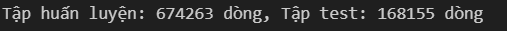
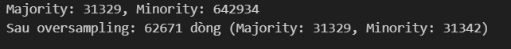
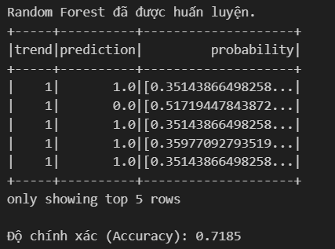
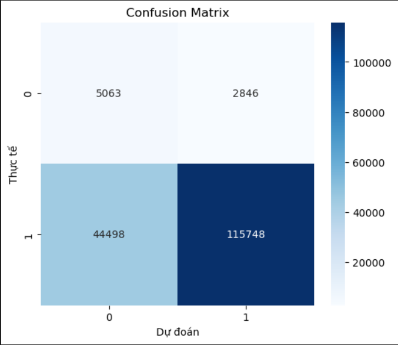
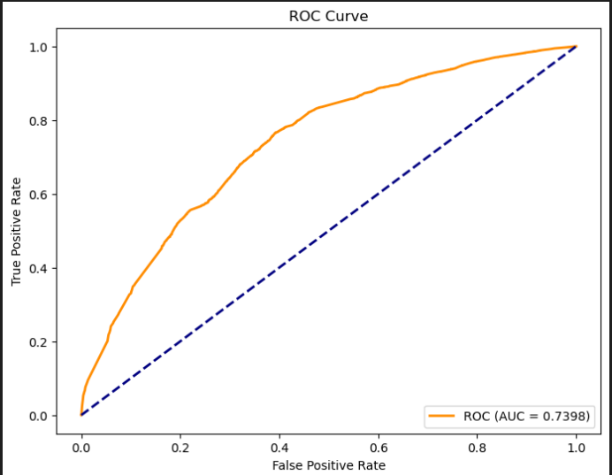
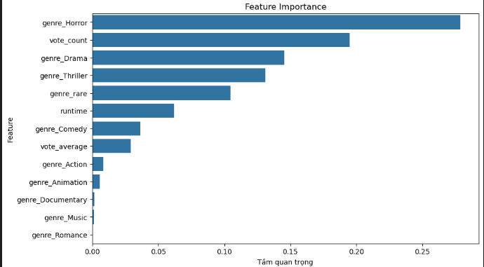
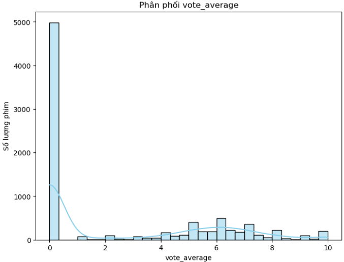
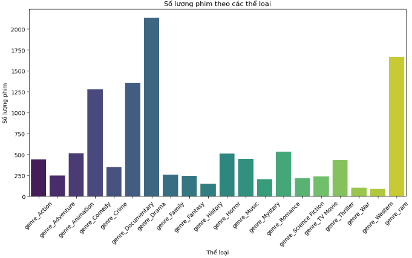
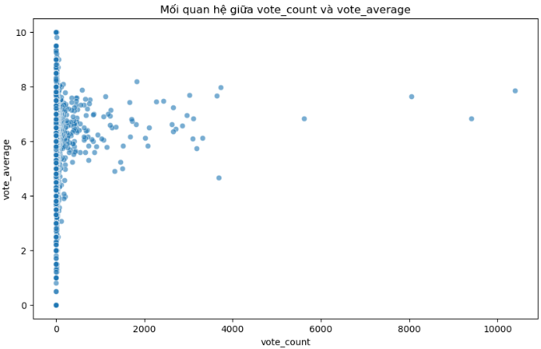

# 🚀 **DỰ ĐOÁN XU HƯỚNG PHIMPHIM** 🎬

---

## 🌟 **1. Giới thiệu**

Chào mừng bạn đến với pipeline dự đoán xu hướng phim sử dụng **Apache Spark MLlib**! 🎥✨ Đây là công cụ mạnh mẽ giúp bạn dự đoán "trend" của các bộ phim dựa trên dữ liệu có sẵn. Từ xử lý dữ liệu, huấn luyện mô hình, đến phân tích kết quả – tất cả đều được gói gọn trong một quy trình đơn giản nhưng hiệu quả! 📊🔍

---

## 🛠️ **2. Các bước thực hiện**

### 📂 **2.1. Xử lý dữ liệu**
- **Đọc dữ liệu**: Lấy dữ liệu từ file `movies_cleaned.csv`.  
- **Tạo biến mục tiêu**: Dùng median của cột `profit` để xác định "trend".  
- **Dọn dẹp**: Loại bỏ các cột không cần thiết để tránh rò rỉ thông tin.  
- **Xử lý genre**: Nhóm các thể loại hiếm thành `genre_rare` cho dữ liệu gọn gàng hơn.  
- **Chuyển đổi**: Biến dữ liệu thành vector feature bằng `VectorAssembler`.  
- **Chia dữ liệu**: 80% để huấn luyện, 20% để kiểm tra.

### ⚖️ **2.2. Oversampling lớp minor**
- Kiểm tra tỷ lệ giữa `trend = 1` và `trend = 0`.  
- Nếu lớp `trend = 1` quá ít, áp dụng oversampling để cân bằng dữ liệu, giúp mô hình học tốt hơn.

### 🌳 **2.3. Huấn luyện mô hình Random Forest**
- Sử dụng `RandomForestClassifier` để xây dựng mô hình phân loại.  
- Huấn luyện trên tập dữ liệu đã được cân bằng.  
- Dự đoán trên tập kiểm tra và đo độ chính xác với **Accuracy**.


### 📈 **2.4. Đánh giá mô hình**
- **Ma trận nhầm lẫn**: Xem chi tiết kết quả dự đoán đúng/sai.  

- **ROC Curve & AUC**: Đánh giá hiệu suất phân loại một cách trực quan.  

- **Feature Importance**: Khám phá đặc điểm nào quan trọng nhất trong dự đoán.


### 🔍 **2.5. EDA (Phân tích dữ liệu khám phá)**
- 📊 Biểu đồ phân phối của `vote_average`.  

- 🎬 Số lượng phim theo thể loại.  

- ⚡ So sánh giữa các nhóm trend để hiểu rõ hơn về dữ liệu.


---

## 🚀 **3. Cách chạy chương trình**

### 💻 **3.1. Yêu cầu hệ thống**
- 🐍 **Python 3.7+**  
- ⭐ **Apache Spark 3.x**

### 📦 **3.2. Cài đặt thư viện**
Chạy lệnh sau để cài đặt các thư viện cần thiết:
```bash
pip install pyspark pandas matplotlib seaborn scikit-learn
```
### 3.3. **Chạy chương trình**
- **Trên terminal:**
```
spark-submit main_pyspark.py
```
